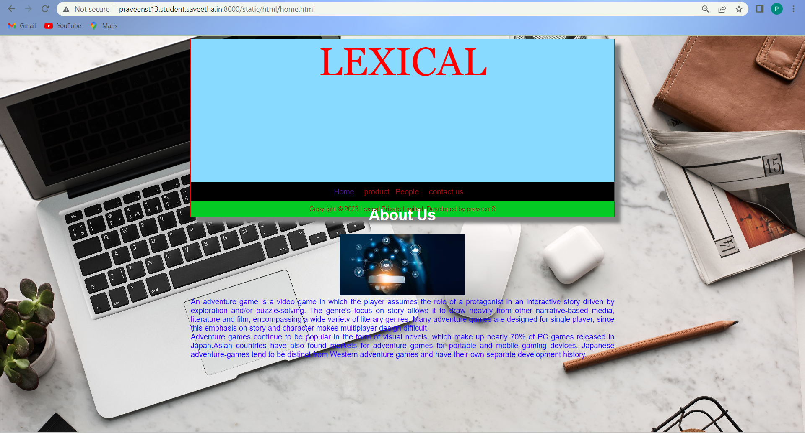
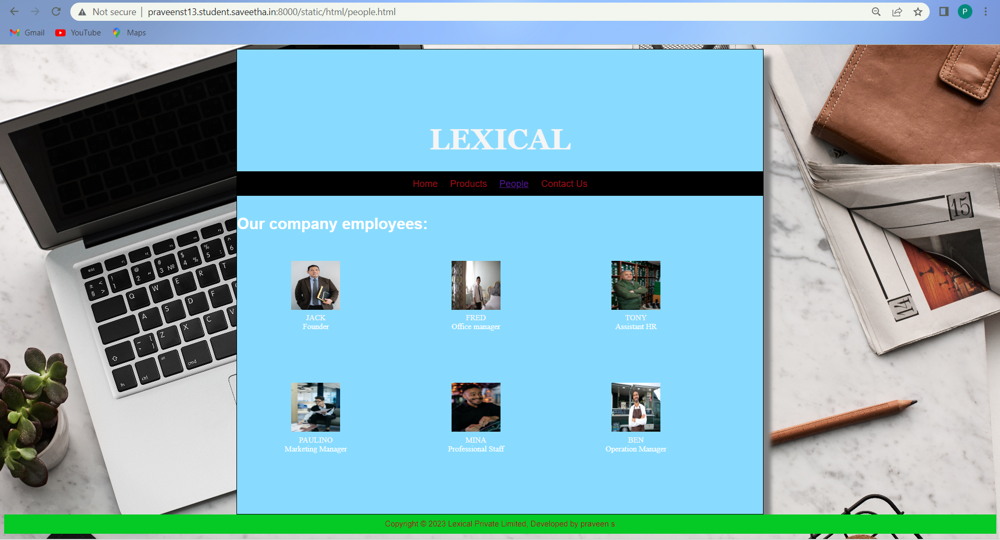

# Web Design for a Software Product Company

## AIM:

To design a static website for a software product company company.

## DESIGN STEPS:

### Step 1:

Requirement collection.

### Step 2:

Creating the layout using HTML and CSS.

### Step 3:

Updating the sample content.

### Step 4:

Choose the appropriate style and color scheme.

### Step 5:

Validate the layout in various browsers.

### Step 6:

Validate the HTML code.

### Step 6:

Publish the website in the given URL.

## PROGRAM :
Home.html:
```
<!DOCTYPE html>
<html lang="en">
  <head>
    <title>Lexical</title>
  </head>
  <body>   
    <div class="container">
      <div class="title">LEXICAL</div>
      <div class="banner"></div>
      <div class="menu">
        <div class="menuitemselected"><a href="home.html">Home</a></div>
        <div class="menuitem"><a href="product.html">product</a>
           <div class="menuitem"><a href ="People.html">People</a></div>
        <div class="menuitem"><a href="contactus.html">contact us</a></div
        </div>
        <div class="homecontent">
          <h1>About Us</h1>
          
          <div class="contenttext">
            An adventure game is a video game in which the player assumes the role of a protagonist
            in an interactive story driven by exploration and/or puzzle-solving. The genre's focus on 
            story allows it to draw heavily from other narrative-based media, literature and film,
            encompassing a wide variety of literary genres. Many adventure games are designed for
            single player, since this emphasis on story and character makes multiplayer design difficult.
            <br>
            Adventure games continue to be popular in the form of visual novels, which
            make up nearly 70% of PC games released in Japan.Asian countries have also found
            markets for adventure games for portable and mobile gaming devices. Japanese 
            adventure-games tend to be distinct from Western adventure  games and have 
            their own separate development history.
          </div>
        </div>
       
      </div>
      <div class="footer">
        Copyright &#169; 2023  Lexical Private Limited, Developed by praveen S
      </div>
    </div>
  </body>
</html>
```
contactus.html:
```
<!DOCTYPE html>
<html lang="en">
  <head>
    <title>LEXICAL</title>
  </head>
  <body>
    <div class="container">
      <div class="banner">LEXICAL</div>
      <div class="menu">
        <div class="menuitem"><a href="home.html">Home</a></div>
        <div class="menuitem"><a href="product.html">Products</a></div>
        <div class="menuitem"><a href="people.html">People</a></div>
        <div class="menuitemselected"><a href="contactus.html">Contact Us</a></div>
      </div>
      <hr>
      <div class="content">
        <div class="homecontent">
          <h1>Contact Us</h1><br><br>
          <h1>Address:</h1>
          <div class="contenttext">
            LEXICAL Private Limited ,Chennai-600 028
          </div><br>
          <h1>Phone:</h1><br>
          <div class="contenttext">
              Mr.gows(MARKETING MANAGER):8220156869<br><br>
              Mr.bhaskar(OPERATION MANAGER):9865432145<br><br>
              Mr.gopathi(OFFICE MANAGER):6384569585
          </div>
          <h1>E-Mail:</h1><br>
          <div class="contenttext">
              Sales:Lexicalprivatelimited@gmail.com
          </div>
        </div>
      </div>
      <div class="footer">
        Copyright &#169; 2023 LEXICAL Limited, Developed by praveen s
      </div>
    </div>
  </body>
</html>
```
People.html:
```
<!DOCTYPE html>
<html lang="en">
  <head>
    <title>LEXICAL</title>
  </head>
  <body>
    <div class="container">
      <div class="banner">LEXICAL</div>
      <div class="menu">
        <div class="menuitem"><a href="home.html">Home</a></div>
        <div class="menuitem"><a href="product.html">Products</a></div>
        <div class="menuitem"><a href="people.html">People</a></div>
        <div class="menuitemselected"><a href="contactus.html">Contact Us</a></div>
      </div>
      <hr>
      <div class="content">
        <div class="homecontent">
          <h1>Contact Us</h1><br><br>
          <h1>Address:</h1>
          <div class="contenttext">
            LEXICAL Private Limited ,Chennai-600 028
          </div><br>
          <h1>Phone:</h1><br>
          <div class="contenttext">
              Mr.gows(MARKETING MANAGER):8220156869<br><br>
              Mr.bhaskar(OPERATION MANAGER):9865432145<br><br>
              Mr.gopathi(OFFICE MANAGER):6384569585
          </div>
          <h1>E-Mail:</h1><br>
          <div class="contenttext">
              Sales:Lexicalprivatelimited@gmail.com
          </div>
        </div>
      </div>
      <div class="footer">
        Copyright &#169; 2023 LEXICAL Limited, Developed by praveen s
      </div>
    </div>
  </body>
</html>
```
Product.html
```
<!DOCTYPE html>
<html lang="en">
  <head>
    <title>LEXICAL</title>
  </head>
  <body>
    <div class="container">
      <div class="banner">LEXICAL</div>
      <div class="menu">
        <div class="menuitem"><a href="home.html">Home</a></div>
        <div class="menuitemselected">
          <a href="product.html">Products</a>
        </div>
        <div class="menuitem"><a href="people.html">People</a></div>
        <div class="menuitem"><a href="contactus.html">Contact Us</a></div>
      </div>
      <div class="content">
        <div class="productcontent">    
          <h1>Our Premium Products</h1>
          <div class="productitems">
              <div class="productitem"> 
                  <div class="itemimage">
                  
                  </div>
                  <div class="itemname">FOOTBALL EVO</div>
                  <div class="itemprice">Price: Rs.7,000.00 </div>
              </div>
              <div class="productitem"> 
                  <div class="itemimage">
                  
                  </div>
                  <div class="itemname">CRICKET CRACKS</div>
                  <div class="itemprice">Price: Rs.8,000.00 </div>
              </div>
          </div>
          </div>        
      </div>
      <div class="footer">
        Copyright &#169; 2023 Limited, Developed by praveen s
      </div>
    </div>
  </body>
</html>
```
## OUTPUT:
### Home Page:

### Contact Page:

### People:

### Product :

## Result:

Thus a website is designed for the software product company and the HTML,CSS code are validated.
